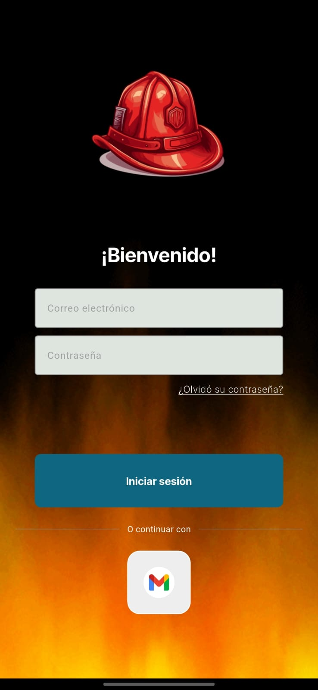
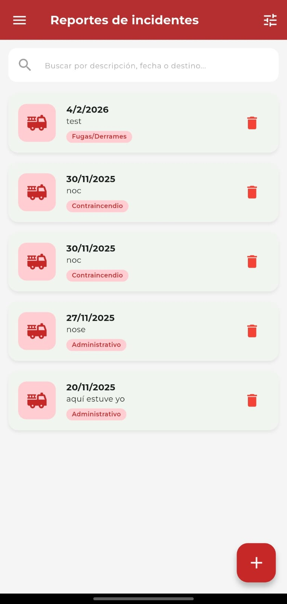
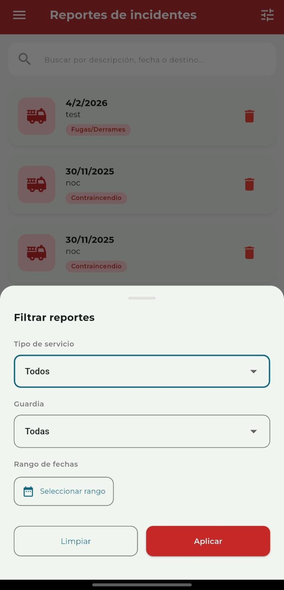
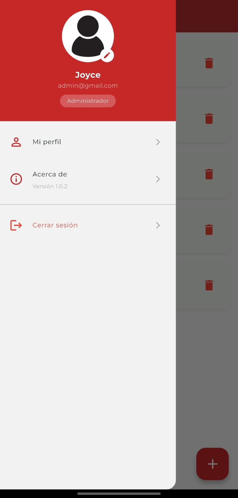
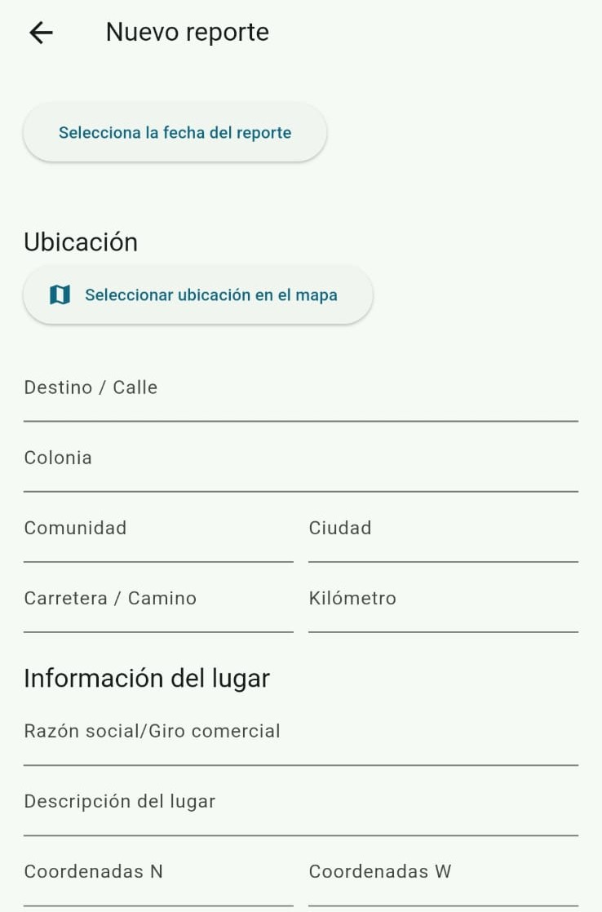
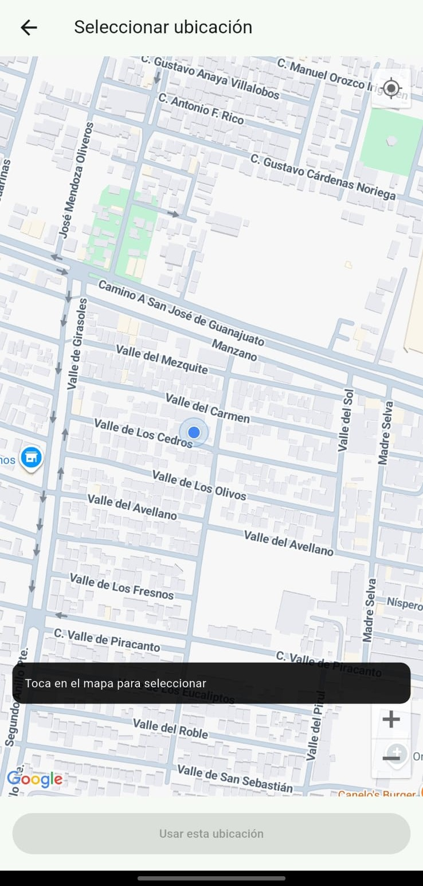

# Sistema móvil de gestión de incidentes (Cuerpos de emergencia)

`proyecto_integrador_bomberos` es una solución tecnológica diseñada para digitalizar y optimizar la administración de reportes de incidentes de bomberos. El sistema sustituye las bitácoras tradicionales en papel por un entorno digital, agilizando el flujo de trabajo desde la captura del incidente hasta la auditoría administrativa.

---

## Características principales

* **Panel de control dinámico (Dashboard):** Interfaz administrativa centralizada para la visualización, filtrado avanzado y gestión completa de registros de incidentes en tiempo real.
* **Geolocalización integrada:** Incorporación de mapas interactivos a través de la API de Google Maps para registrar la ubicación exacta del siniestro.
* **Evidencia multimedia:** Soporte para adjuntar y almacenar documentación visual y fotográfica de los incidentes directamente desde la aplicación.
* **Exportación a PDF:** Generación instantánea de informes formales y reportes de servicio listos para impresión o revisiones institucionales.
* **Seguridad y control de acceso (RBAC):** Autenticación de usuarios y sistema de permisos basado en roles.
* **Perfil personalizado:** Menú de navegación interactivo (*drawer*) para la gestión interna del perfil de cada elemento del cuerpo de bomberos.

---

## Capturas de pantalla de la aplicación

A continuación se muestran algunas secciones clave de la interfaz de usuario, organizadas en un flujo lógico desde el acceso hasta la gestión de reportes:

<p align="center">
  
  
  
  <br>
  
  
  
</p>

---

## Tecnologías utilizadas

* **Frontend / Mobile:** [Flutter](https://flutter.dev/) & [Dart](https://dart.dev/) (Desarrollo multiplataforma nativo).
* **Backend / Base de Datos:** [Firebase](https://firebase.google.com/) (Autenticación, base de datos en tiempo real y almacenamiento en la nube para archivos multimedia).
* **APIs Externas:** Google Maps Platform (Servicios de mapas y geolocalización).

---

## Próximas mejoras (Roadmap)

* [ ] **Modo Offline:** Almacenamiento local de datos para permitir el levantamiento de reportes en zonas de nula conectividad.
* [ ] **Notificaciones push:** Alertas en tiempo real para el despacho inmediato de unidades ante nuevos incidentes.
* [ ] **Módulo de estadísticas avanzadas:** Análisis analítico y gráfico de los siniestros más frecuentes por zona o temporada.

---

## Instalación y configuración

Si deseas ejecutar este proyecto localmente, sigue estos pasos:

1. **Clonar el repositorio:**
   ```bash
   git clone [https://github.com/TU_USUARIO/proyecto_integrador_bomberos.git](https://github.com/TU_USUARIO/proyecto_integrador_bomberos.git)
2. **Instalar las dependencias de Flutter:**
   ```bash
   flutter pub get
3. **Configurar Firebase:**
   * Crea un proyecto en la consola de Firebase.
   * Añade las aplicaciones para Android/iOS.
   * Descarga los archivos de configuración correspondientes (google-services.json / GoogleService-Info.plist) y colócalos en los directorios respectivos del proyecto.
4.  **Ejecutar la aplicación:**
   ```bash
flutter run
